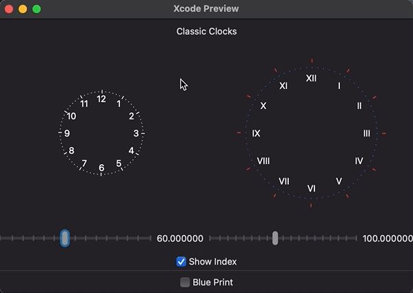
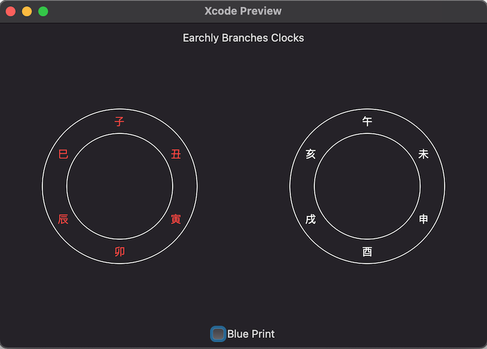

## ClockIndex

### Preview:




### Usage:

```Swift
  // Default clock index with radius 50.0
  ClockIndex().radius(50.0)
  
  // Modify hour index style with radius.
  ClockIndex().hourIndexStyle(StrokeStyle(lineWidth: 5.0).hourStyle(with: indexRadius))
   
  // Custom hour marker text
  ClockIndex(textMarkers: ["I", "II", "III", "IV", "V", "VI", "VII", "VIII", "IX", "X", "XI", "XII"])
  
  // Show/Hide hour index and minutes track
  ClockIndex().showIndex(shouldShowIndex)
```

