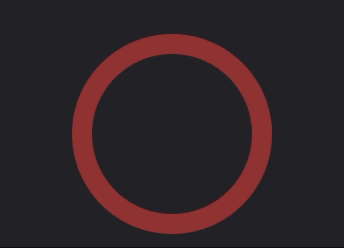
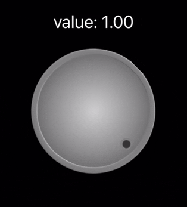
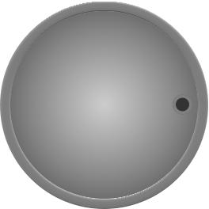

## Knob

### Preview:


### Usage:

Following shows a basic Knob drawing value along the circumference.
```swift
    @State knobValue : Double               // default range: 0.0...1.0
    Knob($knobValue) {
        ArcKnobLayer()                      // Add ArcKnobLayer to draw circumference.
            .arcWidth(10.0)
            .arcColor {
                .blue.opacity(0.7)
            }
    }.frame(width: 100.0, height: 100.0)    // setup knob size
```


---

By adding a ring layer, it makes a Knob which has a circular track. 
```swift
    @State knobValue : Double               // default range: 0.0...1.0.
    Knob($knobValue) {
        RingKnobLayer()                     // Add RingKnobLayer as the track. It has no need to setup value and mapping on RingKnobLayer.
            .ringWidth(10.0)
            .color {
                .red.opacity(0.5)
            }
        ArcKnobLayer()                      // Add ArcKnobLayer to draw circumference.
            .arcWidth(10.0)
            .arcColor {
                .blue.opacity(0.7)
            }
    }.frame(width: 100.0, height: 100.0)
```


Also, it can make the knob and its track much richer by adjusting each layer. For more detail, see [ArcKnobLayer](KnobComponents/Layers/ArcKnobLayer.md)

---

Finally, it can apply images on knob.
```swift
    @State knobValue : Double                       // default range: 0.0...1.0, the range of knob value depends on mapping object.
    Knob($knobValue) {
        ImageKnobLayer(Image("SimpleKnob"))
    }.frame(width: 150, height: 150)    
```


And the image sample is following:




