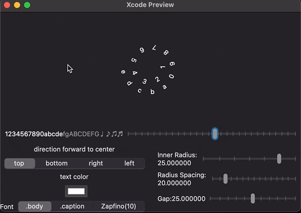

# Rings   

<a href="https://www.buymeacoffee.com/chenhaiteng"></a>

**Rings** is a collection of controls which have similar shapes of ring, circle...

It includes following controls, click to see what it looks like:

* **[RingStack](#ringstack)**
* **[ArcStack](#arcstack)**
* **[RingText](#ringtext)**
* **[ClockIndex](#clockindex)**
* **[HandAiguille](#handaiguille)**
* **[ArchimedeanSpiralText](#archimedeanspiraltext)**
* **[SphericText](#spherictext)**
* **[Knob](#knob)**
* **[GaugeMeter](#gaugemeter)**
* **[RingGaugeMeterStyle](#ringgaugemeterstyle)**

For more detail please refer to the [documentation](https://chenhaiteng.github.io/Docs/Rings/documentation/rings/) 

---
## Installation:
Rings is published with Swift Package Manager, you can get more information at [Swift Package Manager(GitHub)](https://github.com/apple/swift-package-manager), [Package Manager(swift.org)](https://swift.org/package-manager/), and [Swift Packages(Apple)](https://developer.apple.com/documentation/swift_packages)

### Install Rings Step by Step
#### - Add to Xcode(To use this package in your application):

1. File > Swift Packages > Add Package Dependency...
2. Choose Project you want to add Rings
3. Paste repository https://github.com/chenhaiteng/Rings.git
4. Rules > Version: Up to Next Major 0.4.0
It's can also apply Rules > Branch : main to access latest code.
If you want try some experimental features, you can also apply Rules > Branch : develop

**Note:** It might need to link Rings to your target maunally.
1. Open *Project Editor* by tap on root of project navigator
2. Choose the target you want to use Rings.
3. Choose **Build Phases**, and expand **Link Binary With Libraries**
4. Tap on **+** button, and choose Rings to add it.

#### - Add to SPM package(To use this package in your library/framework):
```swift
dependencies: [
    .package(name: "Rings", url: "https://github.com/chenhaiteng/Rings.git", from: "0.4.0")
    // To specify branch, use following statement to instead of.
    // .package(name: "Rings", url: "https://github.com/chenhaiteng/Rings.git", .branch("branch_name"))
],
targets: [
    .target(
        name: "MyPackage",
        dependencies: ["Rings"]),
]
```
---

## RingStack


## ArcStack


## RingText


## ClockIndex


## HandAiguille


## ArchimedeanSpiralText


## SphericText


## Knob


## GaugeMeter


## RingGaugeMeterStyle


---
# License
Rings is released under the [MIT License](LICENSE).

<a href="https://www.buymeacoffee.com/chenhaiteng"></a>
