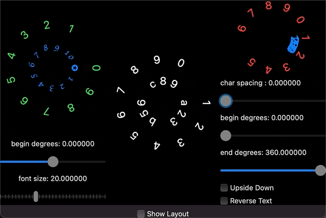

##  RingText



### Usage:

```swift
  // To layout the text "1234567890" along a circle with radius 40.
  RingText(radius: 40.0, text: "1234567890")
  
  // To layout a list to words along a circle with radius 40.
  RingText(radius: 40.0, words: ["1","2","3","4","5","6"])
  
  // To create and setup RingText with rich features:
  RingText(radius: 40.0, text: "1234567890")
    .font(Font.custom("Apple Chancery", size: 16.0)) // Setup font and size
    .begin(degrees: -90.0) // Modify the begining degrees
    .end(degress: 90.0) // Modify the end degrees.
    .textColor(.red) // Change the color of text, default is white.
  
  // Show blueprint of each text (For debug purpose)
  RingText(radius: 40.0, text: "1234567890").showBlueprint(true)
```
